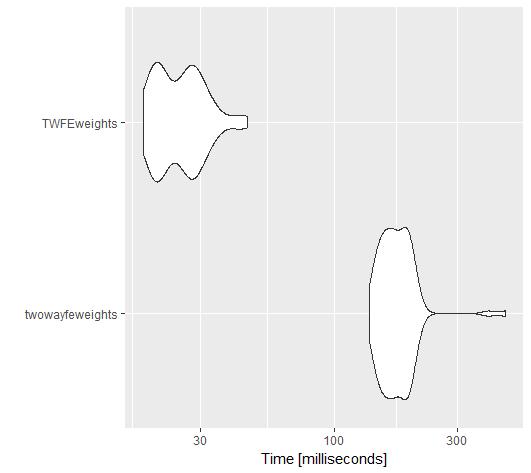
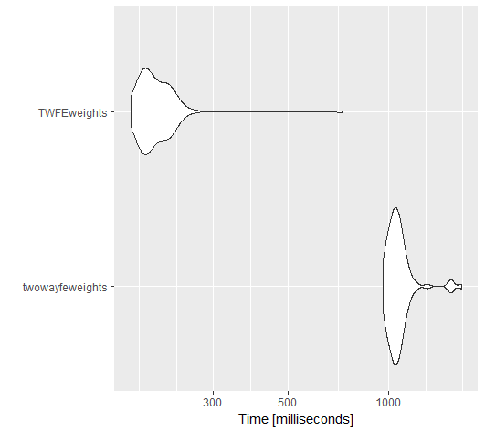

# Two-Way Fixed Effects Weights

**Note**: this package is in progress (5/15).

------------------------------------------------------------------------

In this repository I've update a code from from [Shuo Zhang](https://github.com/shuo-zhang-ucsb/twowayfeweights) repository in [Chaisemartin & D'Haultfoeuille (2020)](https://www.aeaweb.org/articles?id=10.1257/aer.20181169).

Basically, this repo contains a faster way to estimate the Shuo Zhang's code and fix/optimize some parts using [`data.table`](https://github.com/Rdatatable/data.table).

## TWFEweights vs twowayfeweights

I was particularly interested in the performance increase of each function.

``` r
library(dplyr)
library(did2s)

data = did2s::df_hom %>%
  mutate(treat = if_else(treat == T, 1, 0),
         crtl = rbinom(46500, size=1, p=0.7)) %>% 
  rename(Y = dep_var,
         G = group,
         T = year,
         D = treat)
```

### `twowayfeweights_rename_var()`

### `twowayfeweights_normalize_var()`

So with 100 iterations, `TWFEweights()` is faster than `twowayfeweights()` with more than one varible (see figure and code below).

``` r
bench = microbenchmark::microbenchmark(
  "twowayfeweights" = twowayfeweights_normalize_var(data, c("state", "crtl")),
  "TWFEweights" =  twowayfeweights_normalize_var(data, c(state, crtl)),
  times=100L)

#Unit: milliseconds
#           expr      min        lq      mean   median       uq      max neval cld
#twowayfeweights 136.8073 154.54795 177.40709 170.3359 191.0102 460.9254   100   b
#TWFEweights      18.0254  20.57045  25.64296  24.9279  29.0076  45.8401   100  a 

ggplot2::autoplot(bench)
```



### `twowayfeweights_transform()`

With 100 iterations, `TWFEweights` is faster than `twowayfeweights` (see figure and code below). It should be noted the `twowayfeweights::twowayfeweights_transform()` doesn't any message corresponding to:

*The control variable state in the regression varies within some group * period cells. The results in de Chaisemartin, C. and D'Haultfoeuille, X. (2020) apply to two-way fixed effects regressions with controls apply to group * period level controls.*


``` r
bench = microbenchmark::microbenchmark(
  "twowayfeweights" = twowayfeweights_transform(data, controls = c("state", "crtl"), treatments = c("treat1", "treat2"), weights = "weight"),
  "TWFEweights" =  twowayfeweights_transform(data, c(state, crtl), treatments = c(treat1, treat2), weights = weight), times = 100L
)

ggplot2::autoplot(bench)

#Unit: milliseconds
#expr                 min        lq      mean    median        uq      max neval cld
#twowayfeweights 965.8343 1015.8995 1077.3514 1054.9228 1097.0104 1654.607   100   b
#TWFEweights     169.7305  184.8745  205.5734  196.3479  217.6837  724.788   100   a 

ggplot2::autoplot(bench)
```



## Installation (in progress)

You can install the development version from GitHub:

``` r
devtools::install_github("cdcarrion/TWFEweights")
```
